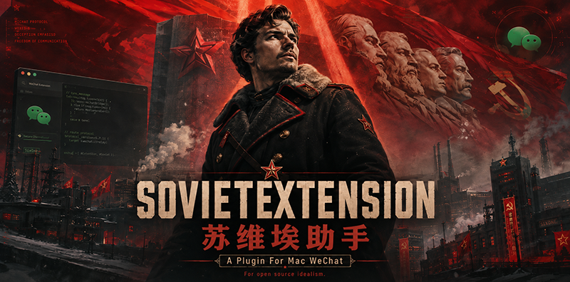

<p align="center">
  
</p>

<h1 align="center">SovietX 苏维埃助手</h1>

<p align="center">
  基于 <a href="https://github.com/MustangYM/SovietExtension">SovietExtension</a> 改造的 Windows 微信插件。
</p>

<p align="center">
  
  
  <a href="LICENSE"></a>
</p>

> 本项目会向微信进程加载插件 DLL。使用前请自行了解风险，并确保符合微信的服务条款及当地法律法规。请勿用于侵犯他人隐私或规避平台规则。

## 功能

- 消息防撤回（仅在运行时版本指纹校验通过时启用）
- 微信多开
- 从系统浏览器打开链接
- 退出群聊提示、撤回消息转发到自己等实验性功能

功能默认关闭。注入成功后，在 SovietX 托盘菜单中按需开启。

## 微信版本适配

| 平台 | 微信版本 | 架构 | 状态 | 对应预编译目录 |
| --- | --- | --- | --- | --- |
| Windows 10/11 | `4.1.11.54` | x64 | 已配置并提供安装脚本 | `SovietX/cross_platform/dist-windows-41154-antirevoke` |

仅支持上表中的 Windows 桌面版微信。安装脚本会拒绝不匹配的版本；其他目录、其他微信版本（包括 `4.1.11.24`）均不作为可用版本发布。

请在微信安装目录中右键 `Weixin.exe`，选择“属性” -> “详细信息”，确认文件版本为 `4.1.11.54`。也可以在 PowerShell 中执行：

```powershell
(Get-Item "C:\Program Files\Tencent\Weixin\Weixin.exe").VersionInfo.FileVersion
```

微信自动更新后，版本可能不再匹配。此时请先停止使用插件，等待新增适配版本，而不要通过修改脚本绕过版本检查。

## 安装与使用

### 准备工作

1. 使用 Windows 10 或 Windows 11 64 位系统，并安装 **Windows 桌面版**微信 `4.1.11.54 x64`。
2. 退出所有微信窗口后，先手动启动一次微信并完成登录，再退出微信。
3. 从本仓库获取代码或下载发布包，进入 `SovietX/cross_platform/dist-windows-41154-antirevoke/bin`。请保持该目录中的 `SovietX.dll`、`SovietInjector.exe`、`install_windows.ps1` 和 `auto_inject.vbs` 位于同一目录。

### 注入插件

1. 在上述 `bin` 目录空白处按住 `Shift` 并右键，选择“在此处打开 PowerShell”。
2. 仅为当前 PowerShell 窗口允许执行本地脚本：

   ```powershell
   Set-ExecutionPolicy -Scope Process Bypass -Force
   ```

3. 启动微信并注入：

   ```powershell
   .\install_windows.ps1 -AutoInject
   ```

   脚本会查找已运行的微信；若未运行，会尝试启动微信后再注入。普通用户运行时只能注入由同一用户启动的微信。如微信以管理员身份启动，请同样以管理员身份打开 PowerShell。

4. 注入成功后，在系统托盘中找到 SovietX 图标，打开菜单并按需启用功能。重启微信后需再次注入，或启用下节的自动注入。

### 自动注入

在 `bin` 目录执行：

```powershell
.\install_windows.ps1 -EnableAutoInject
```

该命令会在当前用户的登录启动项中登记监视器，并立即开始监视微信进程。登录 Windows 后启动微信时，插件会自动注入。

停用自动注入：

```powershell
.\install_windows.ps1 -DisableAutoInject
```

### 其他常用命令

```powershell
# 关闭微信后重新启动并注入
.\install_windows.ps1 -RestartInject

# 仅显示脚本所识别的微信与插件状态
.\install_windows.ps1

# 停用当前微信进程中的插件，并移除自动注入启动项
.\install_windows.ps1 -Uninstall
```

停用后请退出微信；DLL 会在微信进程结束时释放。若遇到无法启动、窗口异常或功能行为不符合预期，先执行卸载命令并退出微信，然后按原方式启动微信即可恢复。

## 从源码构建

构建环境：Visual Studio 2022（包含“使用 C++ 的桌面开发”工作负载）和 CMake 3.20+。

```powershell
cd SovietX\cross_platform
cmake -S . -B build-windows -A x64
cmake --build build-windows --config Release
cmake --install build-windows --config Release --prefix dist-windows-local
```

构建产物安装到 `dist-windows-local/bin` 后，仍须使用与构建时配置完全一致的微信版本。版本适配配置位于 `resources/supported_versions_windows.txt`，Windows 运行时配置位于 `platform/windows/win_antirevoke.cpp`。

## 常见问题

### 提示“不支持的微信版本”

确认使用的是 Windows 桌面版 x64 `4.1.11.54`，并检查微信没有在后台自动更新。不同渠道、预览版或相同显示版本但二进制指纹不同的客户端都可能被拒绝。

### 注入失败或找不到微信

先手动启动并登录微信，再运行 `-AutoInject`。确认 PowerShell 与微信使用同一权限级别；必要时关闭微信后，以管理员身份重新打开二者。

### 防撤回功能未生效

防撤回会对 `Weixin.dll` 的时间戳、映像大小和入口指令进行校验。任一校验不一致时，功能会保持关闭以避免破坏微信进程。请不要修改或跳过该校验。

### 如何完全移除

在 `bin` 目录运行 `.\install_windows.ps1 -Uninstall`，退出所有微信进程后删除该发布目录即可。用户配置位于 `%APPDATA%\SovietX`；确认不再需要配置后可手动删除该目录。

## 说明

- 本项目基于 [SovietExtension](https://github.com/MustangYM/SovietExtension) 改造。
- 仅用于学习、研究和个人使用。
- 欢迎提交可复现的 Bug 报告，并附上 Windows 版本、微信完整版本号和操作日志。

## 开源协议

本项目基于 [MIT License](LICENSE) 开源。
