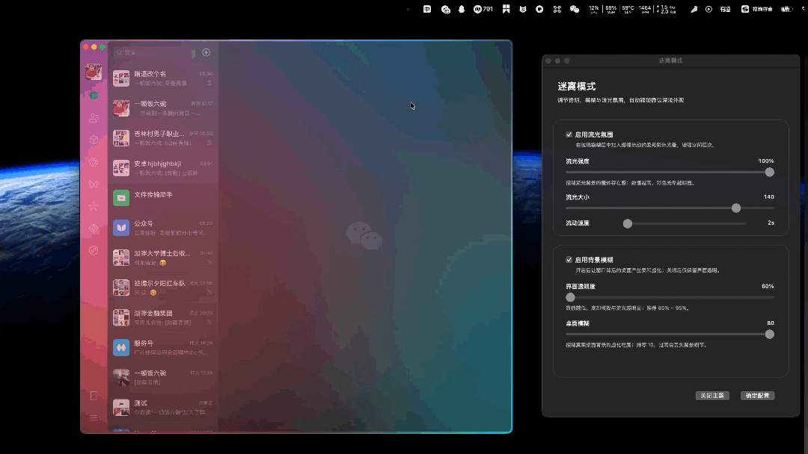
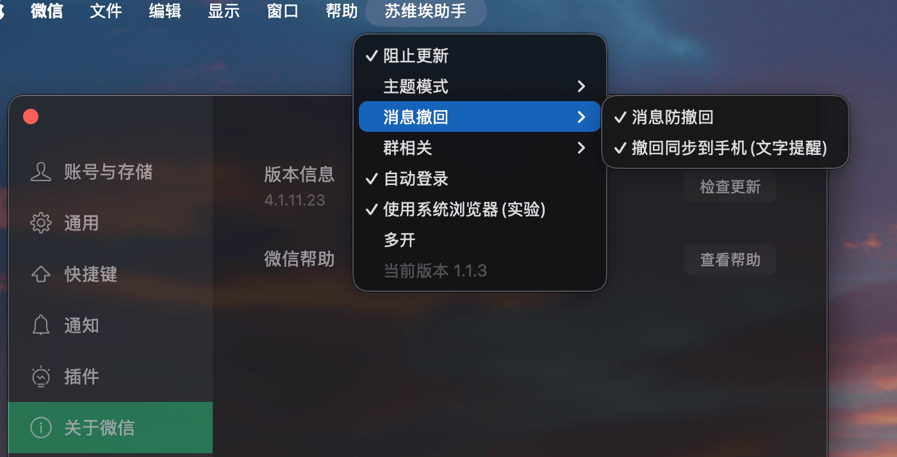
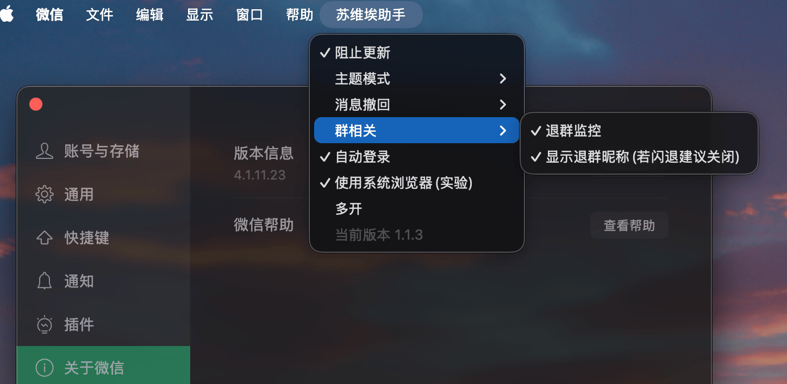
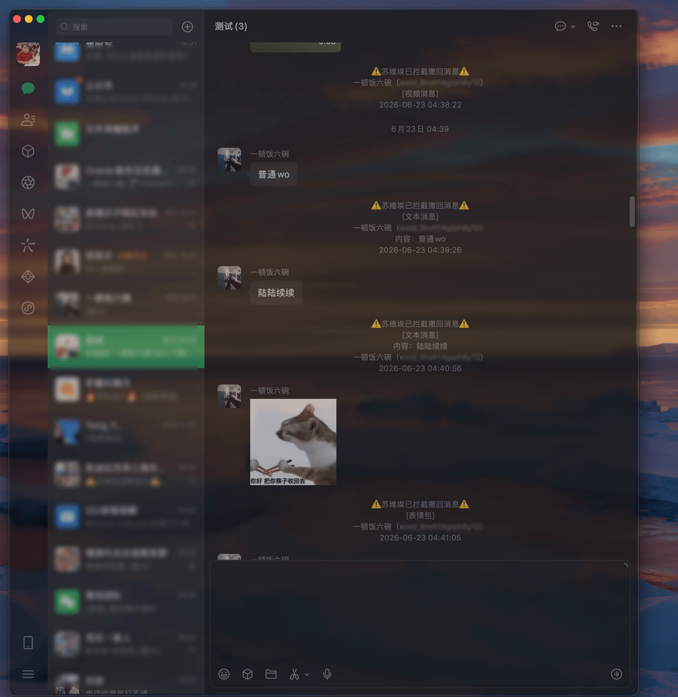
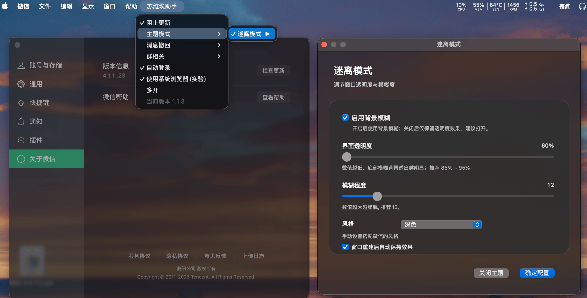

  

<h1 align="center">SovietX 苏维埃助手</h1>

  基于 <a href="https://github.com/MustangYM/SovietExtension">SovietExtension</a> 改造，适配 Windows 系统。 
  免费的，抽象的，令人愉快的微信插件。

  
  
  
  

---

## 效果展示

> 自定义**殺馬特**效果速度、大小、强度，殺馬特or高级感全凭各位自己手艺，我更喜欢殺馬特而已。

> 🔞→嗳丄了祢℡ωǒ…吥徻↘後悔∵╭→很嗳﹎∩ 答应 ↘永逺┈⊕┈与∩ì.在∟┅ ↑起❤️

  

  

  

  

  

---

## 支持版本

> **本项目适配 Windows 版微信，基于原 macOS 版 SovietExtension 的跨平台重构。**
> 微信 4.x QT 化之后逆向起来比较麻烦，具体支持版本以实际测试为准。
> 代码已完全开源，可自行查看，爱你。

| 微信版本 | 支持状态 | 说明 |
| -------- | :------: | ---- |
| 待补充   | 🔧 开发中 | 适配工作正在进行 |

> 不在表格中的版本暂不保证可用。

---

## 安装

### 1. 先打开一次微信

如果是刚安装的微信，请先手动打开一次微信，然后再安装插件。

### 2. 执行安装程序

> 安装方式待补充，适配完成后将提供具体安装步骤。

---

## 常见问题

### 1. 提示版本不支持

请确认你的微信版本是否在支持表格中。

### 2. 安装后微信打不开

可以先执行卸载程序恢复，如果仍然打不开，可以卸载微信后重新安装官方版本。

---

## 卸载

> 卸载方式待补充。

---

## 说明

* 本项目基于 [SovietExtension](https://github.com/MustangYM/SovietExtension) 改造，适配 Windows 平台。
* 仅用于学习、研究与个人折腾。
* 代码完全开源，可自行查看实现。
* 不接受除 Bug 以外的任何 Issue。
* 不接受任何形式的捐赠与收费。
* 版本适配随缘，别催，催就是你对。

---

## 致谢

感谢原作者 **MustangYM** 及湖畔大学全体同学。

感谢 SovietExtension 的所有贡献者。

**瑞思拜。**

---

## 开源协议

本项目基于 MIT 协议开源，详见 [LICENSE](LICENSE)。

